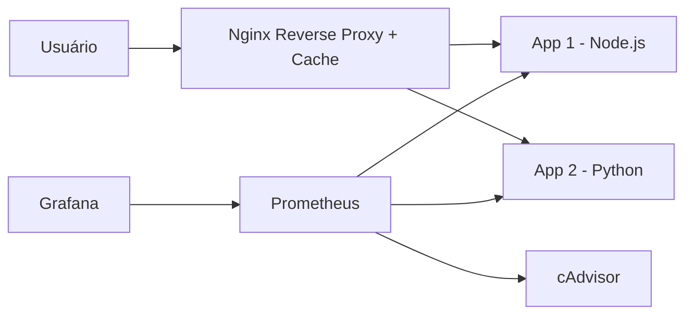
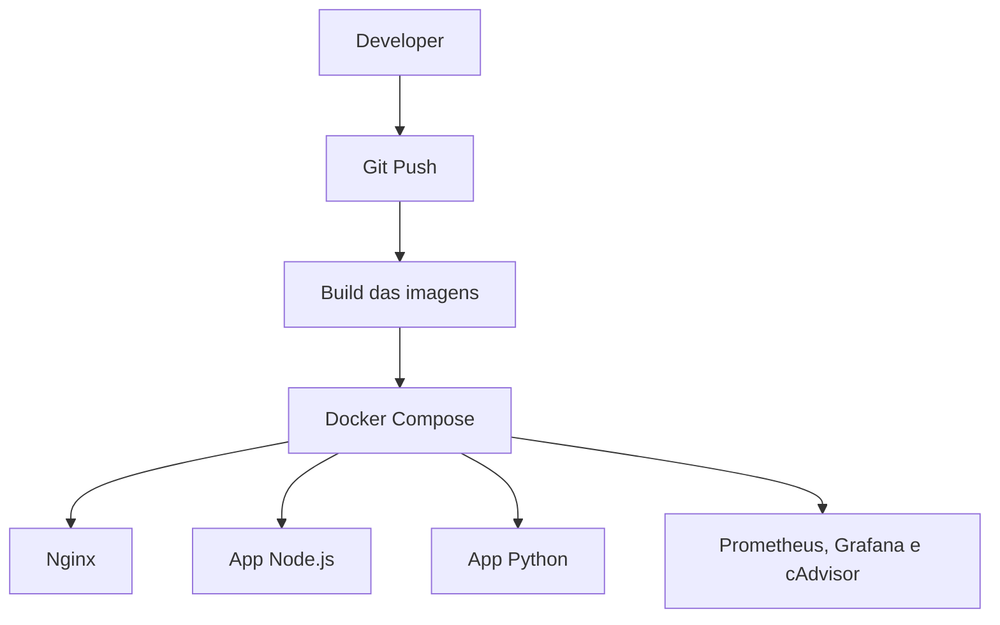

# Desafio DevOps 2025

Projeto completo pronto para subir no GitHub, atendendo aos requisitos do desafio:

- Duas aplicações em **linguagens diferentes**
- Cada aplicação com as rotas:
  - `/texto`
  - `/hora`
- **Camada de cache** com tempos diferentes:
  - App 1: **10 segundos**
  - App 2: **60 segundos**
- **Infraestrutura simples de subir**
- **Observabilidade**
- **Diagrama, análise e sugestões de melhoria**
- **Boas práticas de organização em Git**

## Tecnologias usadas

- **Node.js + Express**
- **Python + FastAPI**
- **Nginx** como reverse proxy e cache
- **Docker Compose**
- **Prometheus**
- **Grafana**
- **cAdvisor**

## Estrutura do repositório

```text
desafio-devops-2025/
├─ app-node/
├─ app-python/
├─ nginx/
├─ observability/
├─ docs/
├─ .github/workflows/
├─ docker-compose.yml
├─ Makefile
├─ README.md
└─ .gitignore
```

## Como subir

### Opção 1
```bash
docker compose up --build
```

### Opção 2
```bash
make up
```

## Endpoints da aplicação

### App 1 - Node.js
- `http://localhost:8080/app1/texto`
- `http://localhost:8080/app1/hora`

### App 2 - Python
- `http://localhost:8080/app2/texto`
- `http://localhost:8080/app2/hora`

## Observabilidade

- **Prometheus**: `http://localhost:9090`
- **Grafana**: `http://localhost:3000`
- **cAdvisor**: `http://localhost:8081`

> Usuário e senha padrão do Grafana, se mantido padrão da imagem: `admin` / `admin`

## Como validar o cache

O Nginx adiciona o header:

```text
X-Cache-Status
```

### Exemplo para a App 1
```bash
curl -i http://localhost:8080/app1/hora
curl -i http://localhost:8080/app1/hora
```

Resultado esperado:
- primeira chamada: `MISS`
- segunda chamada dentro de 10s: `HIT`

### Exemplo para a App 2
```bash
curl -i http://localhost:8080/app2/hora
curl -i http://localhost:8080/app2/hora
```

Resultado esperado:
- primeira chamada: `MISS`
- segunda chamada dentro de 60s: `HIT`

## Diagrama da arquitetura

### Visão da solução



### Fluxo de atualização



## Decisões técnicas

### 1. Reverse proxy e cache com Nginx
Foi escolhido Nginx para centralizar:
- roteamento
- cache
- exposição de headers de cache

Isso deixa as aplicações mais simples e concentra a política de cache em um ponto só.

### 2. Docker Compose
Permite subir tudo com um comando, reduzindo atrito para quem vai avaliar.

### 3. Observabilidade
Foi adicionada uma stack simples com Prometheus, Grafana e cAdvisor para demonstrar preocupação com operação e visibilidade do ambiente.

## Pontos de melhoria

Os detalhes estão em:
- `docs/melhorias.md`
- `docs/arquitetura.md`
- `docs/atualizacao.md`

Resumo:
- adicionar testes automatizados
- melhorar segurança das imagens
- publicar imagens em registry
- adicionar dashboards prontos
- evoluir para Kubernetes em produção
- trocar cache local por Redis se houver múltiplas réplicas

## Entrega

Esse repositório já contém:
- código-fonte das aplicações
- configuração da camada de cache
- infraestrutura automatizada
- documentação da arquitetura
- fluxo de atualização
- sugestões de melhoria

## Como subir no GitHub

```bash
git init
git add .
git commit -m "feat: entrega desafio devops 2025"
git branch -M main
git remote add origin <URL_DO_SEU_REPOSITORIO>
git push -u origin main
```
